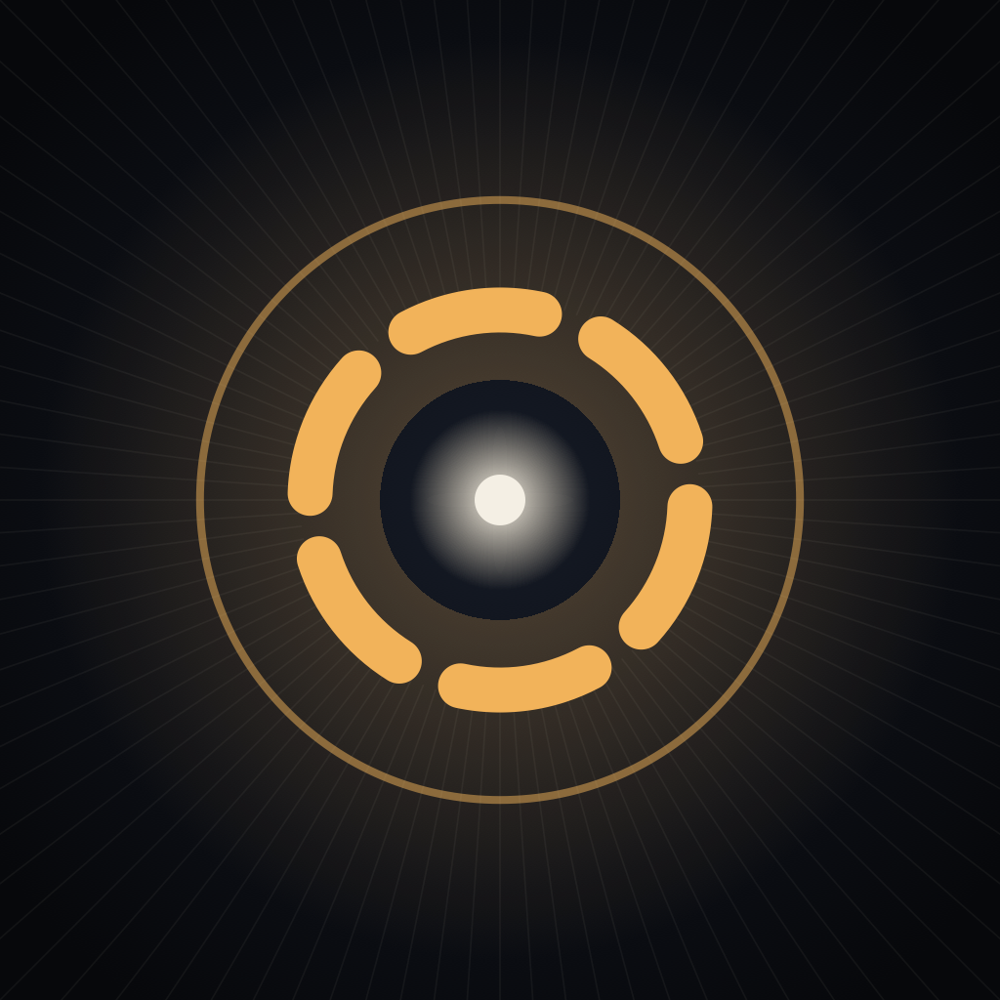
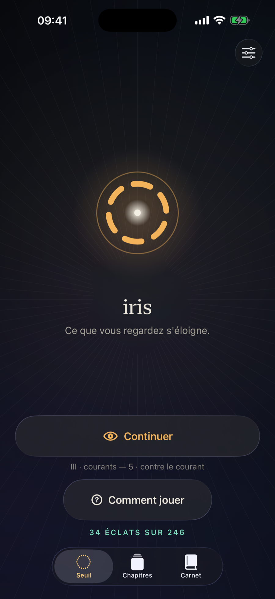
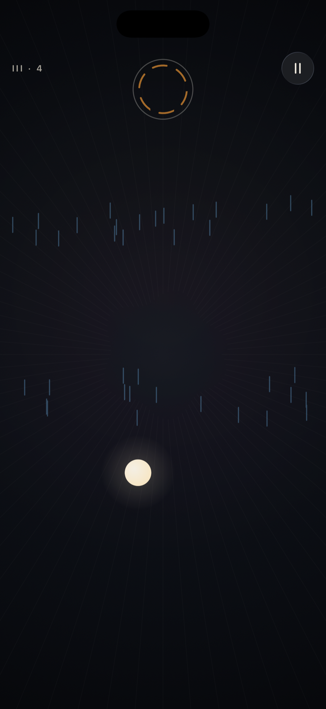
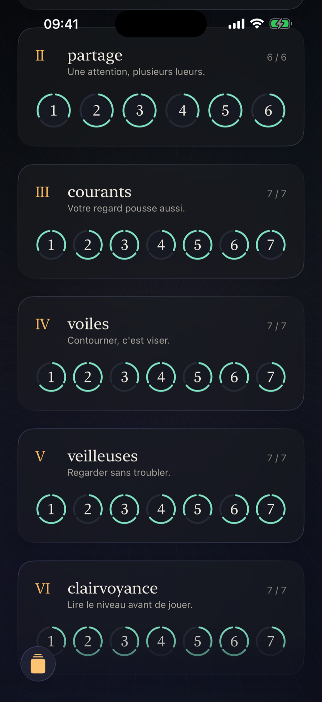
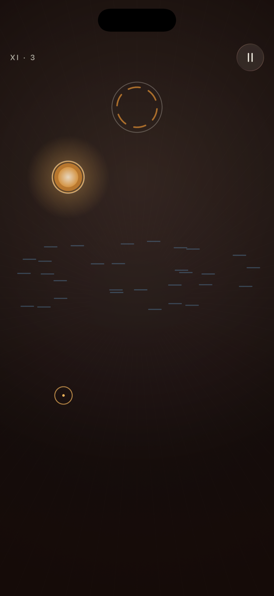
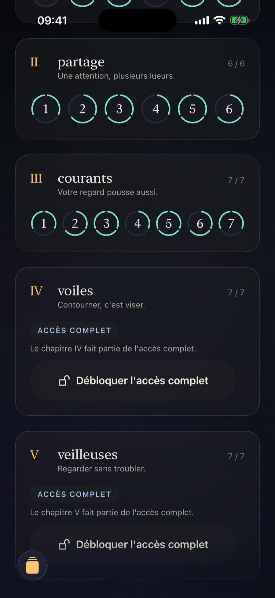
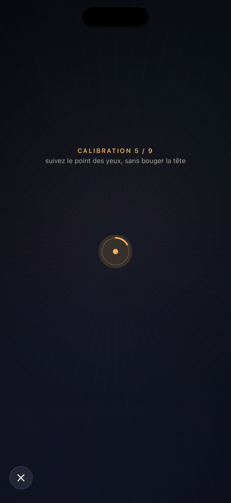

<p align="center">
  
</p>

<h1 align="center">Iris Ways</h1>

<p align="center"><strong>Ce que vous regardez s'éloigne.</strong></p>

<p align="center">
  Un jeu iOS d'attention indirecte, contrôlé par le regard.<br>
  Des lueurs flottent dans le noir et chacune attend son iris. Les fixer les chasse&nbsp;:
  pour les guider, il faut apprendre à poser les yeux à côté.
</p>

<p align="center">
  
  
  
</p>

<p align="center">
  <sub>iOS 17+ · iPhone, portrait · SwiftUI &amp; Swift 6 · suivi facial ARKit · 12 chapitres, 82 niveaux · version 1.0 (build 2)</sub>
</p>

---

## Le jeu en trois phrases

Iris renverse le réflexe le plus naturel du joueur : **regarder une chose directement la repousse**. La maîtrise
consiste donc à regarder *à côté* — à choisir un point vide de l'écran et à laisser la lueur rejoindre son iris.

Une partie dure de quinze secondes à deux minutes, un chapitre de dix à vingt-cinq minutes. Il n'y a ni chronomètre
visible, ni vies, ni défaite : la maîtrise se mesure après coup, jamais pendant.

**Iris est un jeu.** Il ne promet aucun effet de santé, de rééducation ou de bénéfice cognitif, et n'en promettra
jamais.

## Comment ça se joue



La boucle est toujours la même :

1. **Lire le niveau** — l'introduction montre les lueurs, les iris et les obstacles.
2. **Choisir où poser les yeux** — c'est la seule commande du jeu.
3. **Observer la réaction** — le regard repousse ce qu'il touche ; laissée tranquille, une lueur rejoint son iris.
4. **Anticiper et corriger** — la trajectoire se devine plus qu'elle ne se force.
5. **Maintenir la présence 0,75 seconde** sans interruption pour valider un iris.
6. **Protéger les validations acquises** jusqu'au dernier iris fermé.

À la fin du niveau, trois **éclats** peuvent s'allumer : **atteint**, **fluide** (temps sous la référence) et
**serein** (aucune perte, intrusions sous la référence). Les références proviennent d'un simulateur de joueur, avec
une marge — elles sont mesurées, pas décidées à vue.

Aucune défaite n'existe : une validation perdue coûte du temps et l'éclat *serein*. Après quarante-cinq secondes, une
aide contextuelle apparaît. Si le visage sort du champ, le niveau se met en pause et reprend seul.

## La campagne



**Douze chapitres, 82 niveaux.** Chaque chapitre introduit une idée et une seule, puis la combine aux précédentes.
Les chapitres I à III — dix-neuf niveaux — sont jouables sans aucun achat.

| # | Chapitre | Principe |
|---|---|---|
| I | Éveil | Ce que vous regardez s'éloigne. |
| II | Partage | Une attention, plusieurs lueurs. |
| III | Courants | Votre regard pousse aussi. |
| IV | Voiles | Contourner, c'est viser. |
| V | Veilleuses | Regarder sans troubler. |
| VI | Clairvoyance | Lire le niveau avant de jouer. |
| VII | Jumelles | Chacune est l'iris de l'autre. |
| VIII | Souffles | Ce qu'il traverse, il l'emporte. |
| IX | Échos | Un iris qui se ferme réveille ce qui dort à portée. |
| X | Gouffres | Ce qu'il avale revient au départ. |
| XI | Braises | Un regard bref la réveille. Un regard long l'affole. |
| XII | Constellation | Tout ce que vous savez regarder, ensemble. |

Onze chapitres se terminent en outre par un niveau oculomoteur facultatif, construit autour d'un geste du regard
plutôt qu'autour d'un élément.

## Le regard



Iris utilise la **caméra frontale** et le **suivi facial ARKit** pour estimer la direction du regard. Il ne lit que
l'ancre de visage fournie par le système — pose de la tête, position des yeux, point regardé, clignements — et jamais
les images de la caméra.

La mise en route se fait en trois temps :

- **Diagnostic** — une liste de vérifications montre ce qui manque avant de commencer : suivi facial, accès caméra,
  session, visage détecté, direction du regard, stabilité, clignement, axes.
- **Calibration** — une courte séquence de fixations apprend la façon dont ce joueur regarde cet écran.
- **Vérification** — la calibration n'est acceptée que si elle passe un critère de précision ; sinon elle est refaite,
  ou conservée comme non validée si le joueur choisit de continuer.

La calibration peut être refaite à tout moment depuis les réglages. Tout le calcul se fait sur l'appareil, image
après image.

Sur un appareil où le suivi facial ARKit n'est pas disponible, Iris l'annonce clairement et n'ouvre ni calibration,
ni nouvelle acquisition — les droits déjà obtenus restent reconnus et la restauration reste accessible.

## Confidentialité

- Aucune image de la caméra n'est enregistrée.
- Aucune image, aucune donnée de visage et aucune donnée de regard n'est envoyée.
- L'application ne contient aucun code réseau qui lui soit propre, aucun service d'analyse, aucun SDK tiers.
- Restent sur l'appareil : les coefficients de calibration, la progression, les préférences et un indicateur
  d'introduction déjà vue.

Le détail public est publié sur le site du jeu, et la déclaration de confidentialité de la fiche App Store est
« aucune donnée collectée, aucun suivi ».

## Technologie

| Domaine | Choix |
|---|---|
| Langage | Swift 6, concurrence stricte activée |
| Interface | SwiftUI, modèle `@Observable`, matériau Liquid Glass natif d'iOS 26 avec repli sur les versions antérieures |
| Regard | ARKit `ARFaceTrackingConfiguration`, format vidéo à 60 images par seconde, projection du rayon du regard sur le plan de l'écran |
| Moteur de jeu | boucle déterministe pilotée par le temps, entièrement testable hors interface |
| Architecture | couches séparées — `Domain` (campagne et règles), `GameEngine`, `AR` (regard et calibration), `Features` (écrans), `DesignSystem`, `Commerce`, `Navigation` |
| Commerce | StoreKit 2, un seul point d'achat, le droit vient toujours du magasin |
| Localisation | français et anglais, catalogues de chaînes, le français est la langue source |
| Projet | généré par XcodeGen — `project.yml` est la source de vérité |
| Tests | 682 tests, dont un simulateur de joueur qui rejoue chaque niveau de la campagne |
| Protection | 134 fichiers gelés par empreinte SHA-256 : contenu de campagne, moteur du regard et écrans validés ne peuvent pas changer par accident |

La campagne est **écrite comme une donnée**, pas comme du code d'écran : chaque niveau est une définition dans
`Domain/Campaign/`, ce qui permet de la rejouer, de la mesurer et de la geler.

## État du projet

Version **1.0**, build **2**, iPhone, portrait, iOS 17 minimum. La campagne, l'interface, le moteur du regard et le
modèle commercial sont complets et testés ; la suite de tests et les protections d'empreintes tournent à chaque
modification.

Le détail de la préparation de la version — validations sur appareil, états de publication, décisions de release —
vit dans `Docs/`, pas ici.

## Construire et tester

Le projet Xcode est **généré à partir de `project.yml`** : toute modification de structure se fait dans ce
fichier, jamais dans le projet lui-même. La régénération n'est lancée que sur décision explicite.

```bash
# Suite complète, sur un simulateur iPhone
xcodebuild -project Iris.xcodeproj -scheme Iris \
  -destination 'platform=iOS Simulator,name=<votre simulateur>' test

# Build Release pour appareil
xcodebuild -project Iris.xcodeproj -scheme Iris \
  -configuration Release -destination 'generic/platform=iOS' build
```

## Documentation

| Où | Quoi |
|---|---|
| [`Design/`](Design/) | vision, conception du jeu, système de niveaux, modèle de difficulté, direction artistique, contraintes de confort, invariants du noyau |
| [`Docs/methodology/`](Docs/methodology/) | méthode d'ingénierie assistée, architecture des skills, étude de cas |
| [`Docs/AppStore/`](Docs/AppStore/) | métadonnées, notes de revue, plan des captures, produits |
| [`Docs/session-handoffs/`](Docs/session-handoffs/) | états de reprise, dont [le point du 23 septembre 2026](Docs/session-handoffs/2026-09-23-appstore-review-pre-clear.md) |
| [`Docs/PROJECT_LOG.md`](Docs/PROJECT_LOG.md) | le carnet technique complet et daté : architecture détaillée, décisions, mesures, limites honnêtes |
| [`Tools/AgentSkills/`](Tools/AgentSkills/) | la bibliothèque de méthode utilisée pendant le développement |

## Licence

© 2026 Stéphane SAULNIER. Tous droits réservés. Dépôt privé — le code n'est pas distribué sous licence libre.

Iris Ways est couvert par le contrat de licence utilisateur final standard d'Apple. Le site du jeu et sa page
d'assistance sont publiés sur [steve-s.net/iris](https://steve-s.net/iris/).
